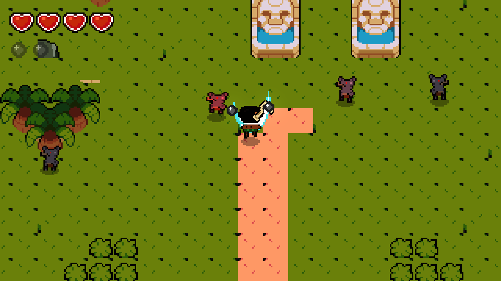
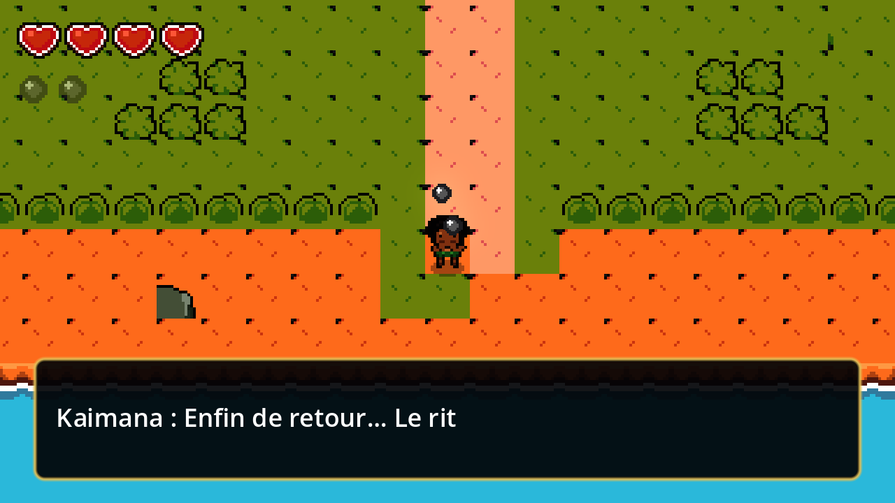
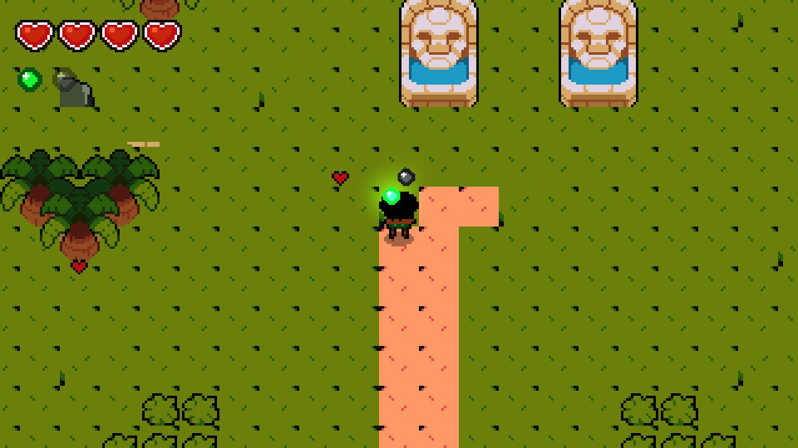

# Kaimana : L'Île des Esprits Silencieux

Un **Zelda-like 2D en pixel art** dans l'esprit de *The Legend of Zelda: The Minish Cap*,
réalisé avec **Godot 4.3+**. Vue de dessus, île tropicale colorée, effets de *glow*, et
un héros polynésien qui manie un crochet d'ivoire habité par des esprits.



## L'histoire

**Kaimana**, prince guerrier de l'île de **Motu Ora** (inspiré de Maui dans *Vaiana*),
rentre de son rituel de passage. Mais quelque chose ne va pas : il ne perçoit plus la
présence des esprits tribaux. Les deux orbes de son crochet d'ivoire sont éteintes —
**Rongo**, l'esprit vert de la nature (soin), et **Ahi**, l'esprit rouge du feu
(projectile).

À peine débarqué, il est attaqué par des **kobolds**, ces créatures mi-loups mi-hommes
du clan des **Crocs-Parjures**, traîtres au serment de ses ancêtres. Une fois la meute
repoussée, l'orbe verte frémit : les esprits ne sont pas partis — ils sont retenus
prisonniers par les totems de l'île.

## Le jeu en images

| Retour au village | Combat contre les kobolds | Éveil de Rongo |
|---|---|---|
|  |  |  |

## Gameplay

Une boucle d'action-aventure à la *Minish Cap* :

- **Déplacement 8 directions** avec animations fluides (respiration à l'arrêt, cycle de
  marche à rebond).
- **Attaque au crochet** en arc, avec une vraie animation du corps (fente et frappe) et
  une traînée lumineuse.
- **Roulade** avec brèves images d'invincibilité et effet d'élan (*squash & stretch*).
- **Cœurs de vie** et esprits à réveiller au fil de l'aventure.
- **Kobolds à IA** : errance, détection, poursuite, puis bond télégraphié.
- **Pouvoirs d'orbes** à débloquer : soin (Rongo, verte) et boule de feu (Ahi, rouge).

### Commandes

| Action | Touches |
|---|---|
| Déplacement | `ZQSD` / `WASD` (position physique) ou flèches |
| Attaque au crochet | `X` ou `J` |
| Roulade | `C`, `K` ou `Espace` |
| Orbe verte — soin (une fois éveillée) | `E` |
| Orbe rouge — boule de feu (une fois éveillée) | `R` |
| Dialogue / confirmer | `Entrée` ou `X` |

## Lancer le jeu

Le projet cible **Godot 4.3 ou supérieur**.

- **Depuis l'éditeur** : ouvrir `project.godot` dans Godot, puis lancer (`F5`).
- **En ligne de commande** :

```bash
godot --path .                      # lance l'écran titre
godot --headless --path . --import  # (ré)importe les assets sans ouvrir l'éditeur
```

Le rendu utilise **Forward+** avec `viewport/hdr_2d` activé : le *glow* 2D fait briller
tout ce dont le `modulate` dépasse 1.0 (orbes, boules de feu, effets).

## Architecture technique

```
assets/sprites/         PNG générés par tools/generate_sprites.py (héros, kobolds, orbes)
assets/external/ninja/  extraits du pack CC0 « Ninja Adventure » (tuiles, FX, UI, audio)
scenes/                 title, island, player, kobold, orb, fireball (.tscn minimalistes)
scripts/                logique GDScript ; l'essentiel est construit en code
tools/                  générateur de sprites (Python/PIL) + scène de capture de test
docs/screenshots/       captures utilisées dans ce README
```

Quelques partis pris :

- La **carte de l'île est une chaîne ASCII** dans `scripts/island.gd`, et le `TileSet`
  est construit au runtime en code (pas de `.tres`).
- Les **animations de personnages** sont assemblées par calques (tête / torse / jambes)
  dans le générateur Python, puis les `SpriteFrames` sont bâtis en code
  (`sprite_frames_builder.gd`). La fluidité est complétée par du *squash & stretch* en
  tween.
- L'**UI** (HUD, dialogue, écran titre) est entièrement construite en code.

Pour le détail complet (choix structurants, pièges, roadmap), voir [`CLAUDE.md`](CLAUDE.md).

## Direction artistique

Style *Minish Cap* revisité en île tropicale « glow » :

- Proportions **chibi**, sprites 16×24, tuiles 16×16, contours sombres et chauds.
- Personnages custom (Kaimana, kobolds) générés par `tools/generate_sprites.py` — ce sont
  des **placeholders** destinés à être remplacés par de vrais sprites dessinés.
- Décors, tuiles, effets, interface et audio issus du pack **Ninja Adventure**.

## Crédits & licence

- Environnement, FX, UI et audio : pack **« Ninja Adventure »** de *pixel-boy & AAA*,
  sous licence **CC0 1.0** — <https://pixel-boy.itch.io/ninja-adventure-asset-pack>.
  Voir `assets/external/ninja/LICENSE.txt` et `ATTRIBUTION.txt`.
- Sprites de Kaimana et des kobolds : originaux, générés par le script du projet.

## Roadmap

- Éveil d'Ahi (orbe rouge) : donjon / totem à libérer, boss kobold.
- Objets à la *Minish Cap* (grappin avec le crochet, rétrécissement).
- Village, PNJ et quêtes.
- Vrais sprites dessinés pour le héros et les kobolds.
- Eau animée.
